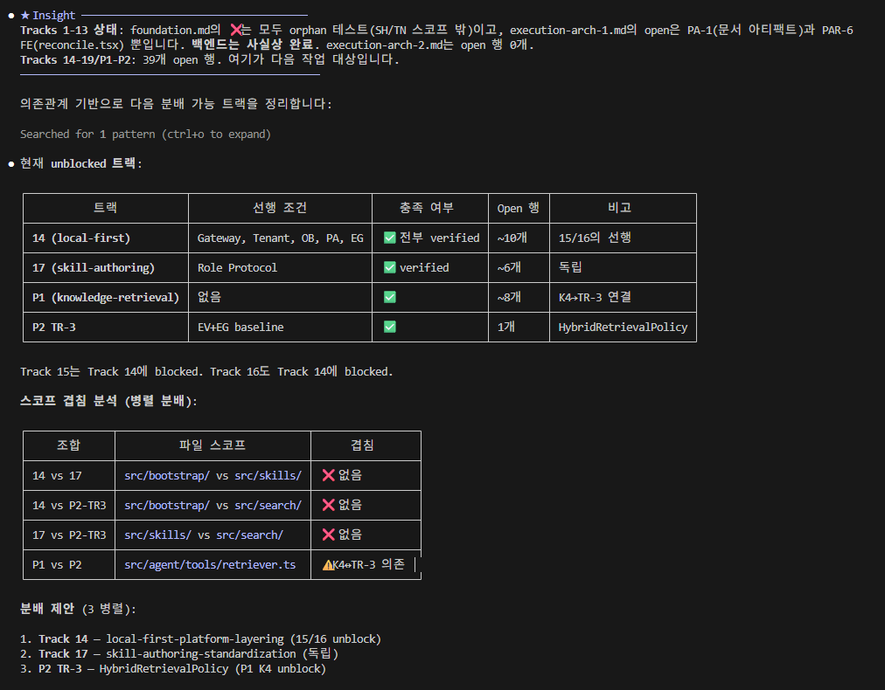
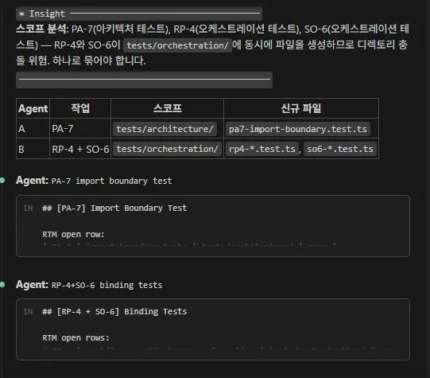
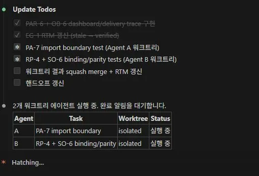
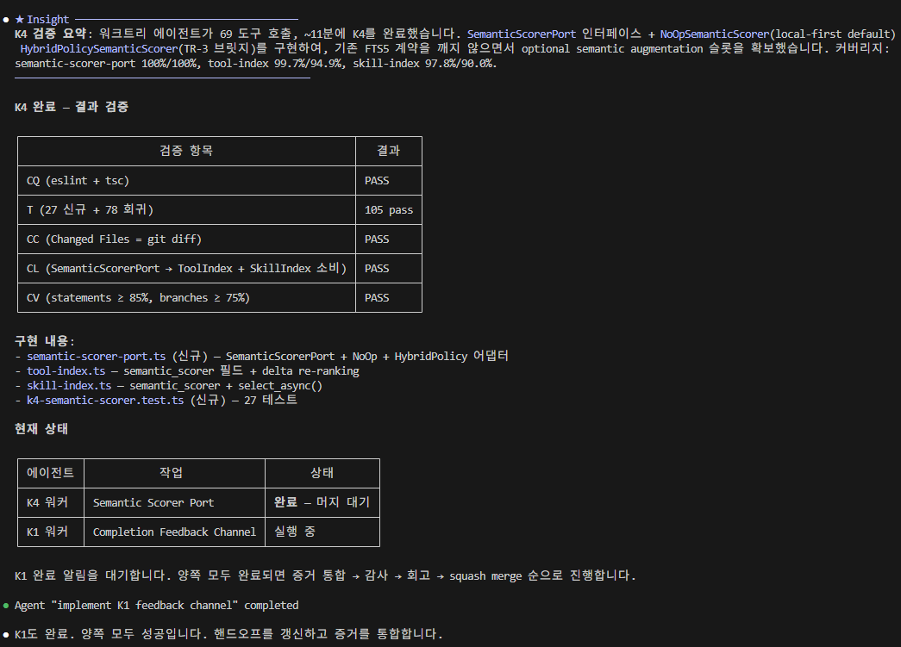
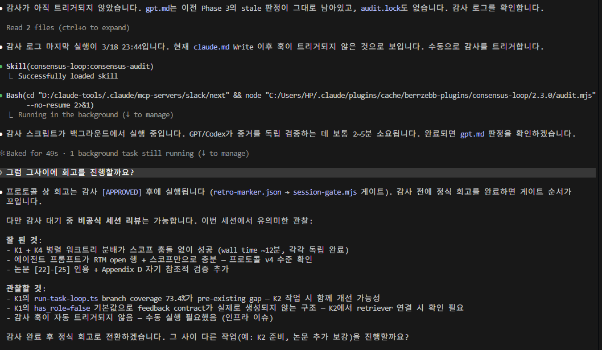
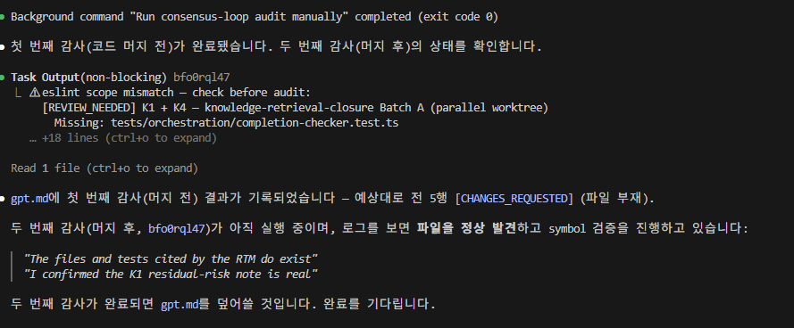
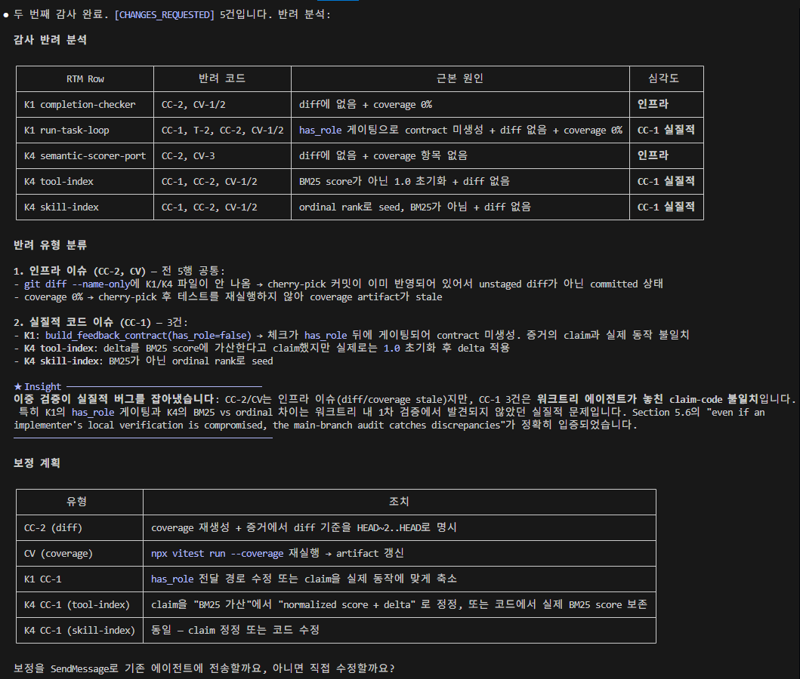
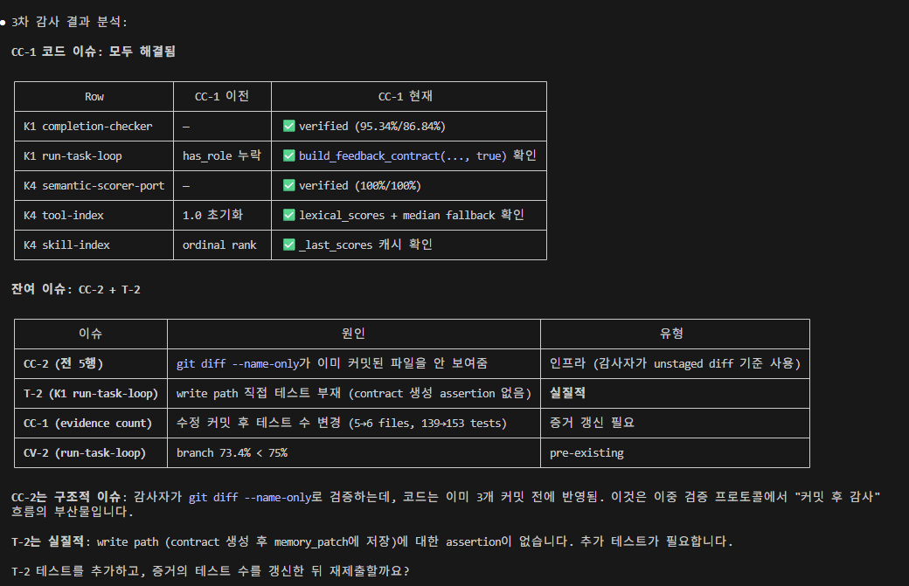
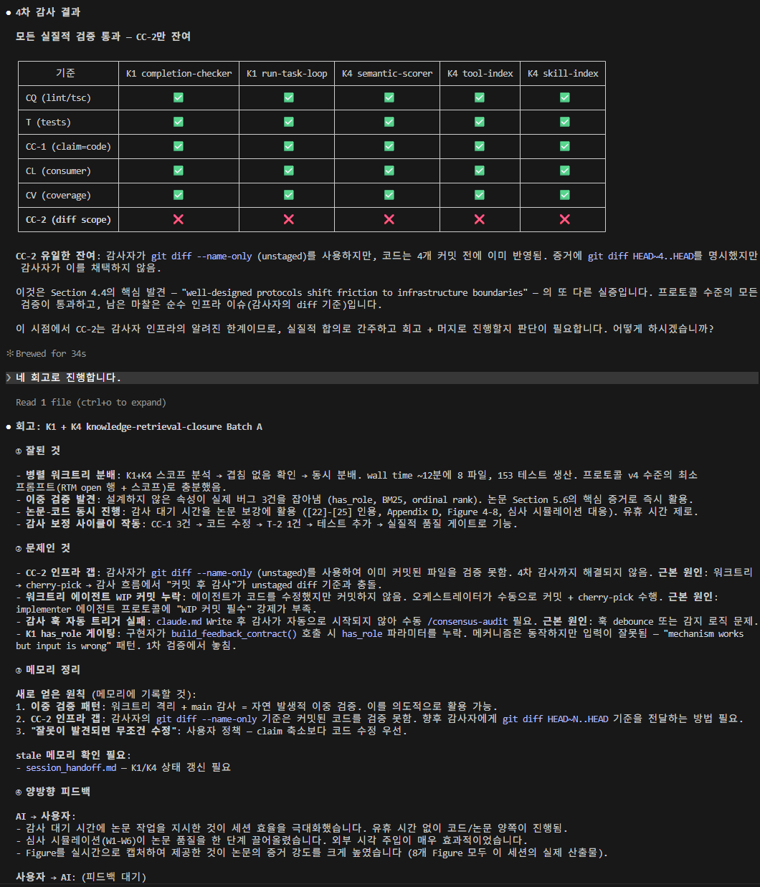
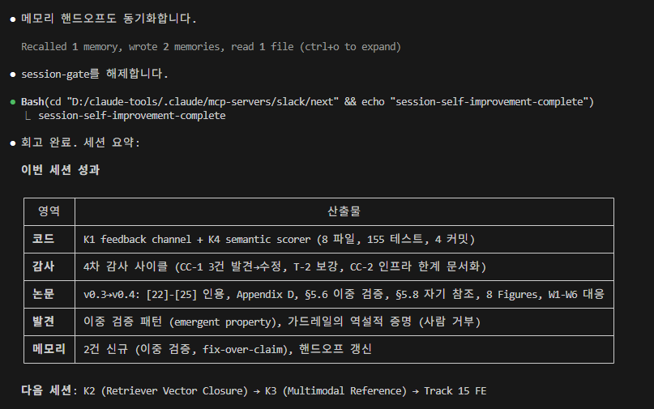

# consensus-loop

**AI writes code. A different AI reviews it. Nothing ships without consensus.**

A Claude Code plugin that enforces a cross-model audit gate on every code change. Claude implements, GPT/Codex reviews, and a human-in-the-loop retrospective ensures the team learns from each cycle.

```bash
claude plugin marketplace add berrzebb/claude-plugins
claude plugin install consensus-loop@berrzebb-plugins
```

That's it. All hooks, skills, agents, and MCP tools are auto-registered.

---

## The Problem

AI coding tools generate code fast. They also generate bugs fast, skip tests, drift from requirements, and self-validate their own blind spots. Instruction-based corrections ("always write tests") fade across sessions. **The model cannot reliably catch its own mistakes through self-review.**

## The Solution

Structure beats instruction. consensus-loop makes it **structurally impossible** to ship unreviewed code:

1. **You write** → Claude implements in an isolated git worktree
2. **A different model reviews** → GPT/Codex independently audits the evidence
3. **Nothing merges without consensus** → `[APPROVED]` requires auditor sign-off, not self-promotion
4. **The team learns** → Mandatory retrospective after each cycle, session-gate enforced

```
planner → scout (RTM) → orchestrator → implementer (worktree) → verify → audit → retro → merge → loop
```

---

## Quick Start

### 1. Install

```bash
claude plugin marketplace add berrzebb/claude-plugins
claude plugin install consensus-loop@berrzebb-plugins
```

### 2. Configure

```bash
# Copy example config to your project
cp ~/.claude/plugins/cache/berrzebb-plugins/consensus-loop/*/examples/config.example.json \
   .claude/consensus-loop/config.json

# Copy prompt templates
cp -r ~/.claude/plugins/cache/berrzebb-plugins/consensus-loop/*/examples/templates/ \
      .claude/consensus-loop/templates/
```

Edit `config.json` — set your tags and paths:

```json
{
  "consensus": {
    "watch_file": "docs/feedback/claude.md",
    "trigger_tag": "[REVIEW_NEEDED]",
    "agree_tag": "[APPROVED]",
    "pending_tag": "[CHANGES_REQUESTED]"
  }
}
```

### 3. Use

```
/consensus-loop:orchestrator     # Start a work session
/consensus-loop:planner          # Design new tracks interactively
/consensus-loop:verify           # Check done-criteria before submission
/consensus-audit                 # Trigger manual audit
/consensus-status                # Show current loop state
```

---

## Real-World Reference: SoulFlow Orchestrator

consensus-loop was built to manage [SoulFlow Orchestrator](https://github.com/berrzebb/SoulFlow-Orchestrator) — a 32MB TypeScript codebase with 141 workflow nodes, 9 AI providers, and 188 deterministic tools.

**Results from production use:**

| Metric | Value |
|--------|-------|
| Tracks planned | 17 (+ 2 parallel support tracks) |
| Tracks RTM-scanned | 13 in 3 scout runs |
| Broken cross-track links found | 8 (automatically, in one pass) |
| Orphan tests identified | 7 |
| Parallel workers per session | Up to 3 (background, worktree-isolated) |
| Test suite | 104 tests across 21 suites |

**What RTM looks like in practice:**

A single scout run on 5 foundation tracks produced 3-way traceability matrices revealing:
- Backend code: ~90% verified across all 5 tracks
- Frontend: consistently `wip` (intentionally deferred to Track 15)
- Concrete next steps: PA-5 (ArtifactStore extraction) and PAR-4 (workflow fanout) identified as the only true `open` items

The scout eliminated redundant exploration — implementers received pre-verified RTM rows and skipped straight to coding.

**In action — orchestrator analyzing RTM state and proposing parallel distribution:**



*The orchestrator reads RTM state across all tracks, identifies 4 unblocked tracks (14, 17, P1, P2), checks file scope overlap between every pair (only P1 vs P2 has a dependency warning), and proposes 3 parallel agents with non-conflicting scopes.*

**Orchestrator distributing RTM-based work to parallel agents:**



*The orchestrator detects that PA-7 and RP-4+SO-6 touch different directories, assigns them to separate agents, and each agent receives only its RTM open rows.*

**Parallel worktree agents executing in the background:**



*Agent A (PA-7 import boundary) and Agent B (RP-4+SO-6 binding tests) execute in isolated worktrees. The orchestrator tracks completion status and waits for both to finish before proceeding to merge.*

**Full cycle completion — done-criteria verification + evidence integration:**



*Both parallel workers pass all done-criteria (CQ, T, CC, CL, CV — all PASS, 105 tests including 27 new + 78 regression). The orchestrator integrates evidence from both worktrees and proceeds to audit → retrospective → squash merge.*

**Audit trigger + retrospective gate enforcement:**



*The orchestrator triggers `/consensus-audit`. The agent recognizes that retrospective must wait for `[APPROVED]` verdict (retro-marker.json → session-gate.mjs). Structural guardrails enforce protocol order — the agent cannot skip ahead.*

**Cross-model audit verdict — [CHANGES_REQUESTED] with specific evidence:**



*The independent auditor (GPT/Codex) issues `[CHANGES_REQUESTED]` citing a missing test file and scope mismatch. The second audit independently verifies RTM rows — "The files and tests cited by the RTM do exist." The agent then performs retrospective on the rejection, identifying what went wrong and what to improve.*

**Emergent double verification — main-branch audit catches what worktree verification missed:**



*The main-branch audit discovers 3 substantive CC-1 issues that passed worktree-local verification: has_role gating mismatch, BMS25 score initialization, ordinal rank seed. This is the emergent double verification in action — two structurally independent verification passes catch different failure classes.*

**Correction cycle resolution — all CC-1 issues fixed, remaining issues classified:**



*After correction: all CC-1 claim-code mismatches resolved (has_role ✅, lexical_scores ✅, _last_scores ✅). Remaining issues cleanly classified — CC-2 is infrastructure (git diff baseline), T-2 is substantive (write path assertion missing). The protocol's correction cycle converges.*

**Final audit pass + full retrospective — protocol cycle complete:**



*All 5 RTM rows pass CQ, T, CC-1, CL, CV. Only CC-2 (infrastructure diff baseline) remains. The orchestrator proceeds to retrospective: what went well (parallel distribution, double verification), what went wrong (CC-2 gap, WIP commit missing, audit hook trigger), memory cleanup, and bidirectional feedback. The full protocol cycle — plan → scout → distribute → implement → verify → audit → correct → re-audit → retrospective → merge — is complete.*

**Session gate release + handoff — cycle complete, next session prepared:**



*`echo "session-self-improvement-complete"` releases the gate. Session summary: 8 files + 155 tests produced, 4 audit rounds completed, paper advanced v0.3→v0.4 with 8 Figures, emergent double verification discovered. Handoff specifies next tasks: K2 (Retriever Vector Closure) → K3 (Multimodal Reference) → Track 15 FE.*

---

## Lightweight Entry: Audit Gate Only

Don't need the full orchestration? Use just the audit gate:

**What you get:**
- Every file edit → cross-model audit (async, non-blocking)
- `[trigger_tag]` → `[agree_tag]` or `[pending_tag]` with specific file:line rejection codes
- Quality rules (ESLint, npm audit) run inline on matching edits
- Session gate blocks commits until retrospective completes

**What you skip:**
- Orchestrator/implementer multi-agent workflow
- Scout + RTM traceability
- Work breakdown planning

**How:** Install the plugin normally, then disable the skills you don't need. The hook cycle (`index.mjs` → `audit.mjs` → `respond.mjs` → `session-gate.mjs`) works independently of the orchestration layer.

---

## How It Works

### Full Development Cycle

```
planner ─── Interactive 6-phase requirement definition
    ↓
scout ─── dependency_graph + code_map → 3-way RTM (Forward/Backward/Bidirectional)
    ↓
orchestrator ─── Distribute Forward RTM rows → scope validation → parallel background spawn
    ↓
┌─── Track A (worktree) ──────┐  ┌─── Track B (worktree) ──────┐
│  implementer: RTM rows only  │  │  implementer: RTM rows only  │
│  → verify (8 categories)     │  │  → verify (8 categories)     │
│  → submit RTM-based evidence │  │  → submit RTM-based evidence │
│  → audit (async, background) │  │  → audit (async, background) │
│  [pending] → fix failed rows │  │  [approved] → WIP commit     │
│  [approved] → WIP commit     │  │                               │
└──────────────────────────────┘  └──────────────────────────────┘
    ↓
retrospective (session-gate enforced) → merge (squash) → handoff → next RTM row
```

### Verification Categories (8)

| # | Category | What it checks |
|---|----------|---------------|
| 1 | Code Quality (CQ) | Per-file eslint + tsc + forbidden patterns |
| 2 | Test (T) | Test execution + direct test per claim + no regressions |
| 3 | Claim-Code (CC) | Evidence matches git diff |
| 4 | Cross-Layer (CL) | BE→FE contracts documented |
| 5 | Security (S) | OWASP TOP 10 + input validation + auth guards |
| 6 | i18n (I) | Locale keys in all supported locales |
| 7 | Frontend (FV) | Page loads, DOM, console errors, build |
| 8 | Coverage (CV) | Statement ≥ 85%, Branch ≥ 75% per changed file |

### Deterministic MCP Tools (6)

These tools provide **facts, not inference** — used by all roles:

| Tool | What it does |
|------|-------------|
| `code_map` | Cached symbol index with line ranges |
| `dependency_graph` | Import/export DAG, connected components, topological sort, cycle detection |
| `audit_scan` | Pattern scan (type-safety, hardcoded strings, console.log) |
| `coverage_map` | Per-file coverage percentages from vitest JSON |
| `rtm_parse` | Parse RTM markdown → structured rows, filter by req_id/status |
| `rtm_merge` | Row-level merge of worktree RTMs with conflict detection |
| `audit_history` | Query persistent audit history — verdicts, rejection patterns, risk detection |

### Hook Cycle

```
Code Edit → PostToolUse (index.mjs)
    ├─ watch_file + trigger_tag → spawn audit (detached, async)
    ├─ gpt.md newer → auto-sync (promote/demote tags)
    ├─ planning file → normalize
    └─ quality rule match → run check inline
```

Audit runs in background. Hook returns immediately. No blocking.

---

## Key Design Decisions

**1. Structure over instruction.** Behavioral constraints enforced by code (session-gate, audit.lock) are more reliable than behavioral constraints enforced by prompts. You can't instruct Claude to consistently catch `test-gap` across sessions. But you can build a gate that makes it structurally impossible to proceed until a peer model confirms.

**2. Facts over inference.** The 6 MCP tools provide deterministic data — file existence, import chains, coverage percentages, symbol indices. Models judge; tools measure. This makes results stable across model changes.

**3. Policy as data.** All audit criteria, rejection codes, and evidence formats are in editable markdown files (`templates/references/`). To change audit standards, edit a file. No code changes.

**4. Fail-open safety.** Every hook fails open — errors pass through silently. The system never locks you out. `session-gate.mjs` errors → pass. Audit failures → pass. Config missing → graceful defaults.

**5. Scout once, implement many.** The scout generates a Requirements Traceability Matrix (RTM) once per track. All subsequent agents work from those facts, not from re-exploration. Cost: ~8K tokens (one-time). Savings: ~5K tokens per worker per round.

---

## Architecture

### Roles

| Role | What it does | Model |
|------|-------------|-------|
| **Planner** | Interactive 6-phase requirement definition | Opus |
| **Scout** | Read-only 3-way RTM generation using deterministic tools | Opus |
| **Orchestrator** | Task distribution, agent tracking, correction cycles | Inherited |
| **Implementer** | Code in worktree, test, submit evidence, handle corrections | Sonnet |
| **Auditor** | Independent per-row verification of RTM evidence | GPT/Codex |

### Skills (5)

| Skill | Purpose |
|-------|---------|
| `consensus-loop:orchestrator` | Session orchestration — scout, distribute, track, correct |
| `consensus-loop:verify` | Done-criteria verification (8 categories) |
| `consensus-loop:merge` | Squash-merge worktree with structured commit |
| `consensus-loop:planner` | Interactive track definition + work breakdown |
| `consensus-loop:guide` | Evidence package writing guide |

### Agents (2)

| Agent | Purpose |
|-------|---------|
| `consensus-loop:implementer` | Headless worker in worktree — code, test, evidence |
| `consensus-loop:scout` | Read-only RTM generator — 3-way traceability |

---

## Porting to Another Project

```bash
# 1. Install
claude plugin marketplace add berrzebb/claude-plugins
claude plugin install consensus-loop@berrzebb-plugins

# 2. Configure (edit tags + paths)
# 3. Edit templates/references/ for your team's policies
```

Minimal config for English projects:

```json
{
  "plugin": { "locale": "en" },
  "consensus": {
    "watch_file": "docs/review/author.md",
    "trigger_tag": "[REVIEW_NEEDED]",
    "agree_tag": "[APPROVED]",
    "pending_tag": "[CHANGES_REQUESTED]"
  }
}
```

---

## Contributing

| Contributor | Contributions |
|---|---|
| [@berrzebb](https://github.com/berrzebb) | Core architecture, RTM system, MCP tools, multi-agent orchestration |
| [@dandacompany](https://github.com/dandacompany) | Security fixes (#1 shell injection, #2 plugin support), locale path traversal + ESM require fix |

---

## License

MIT
