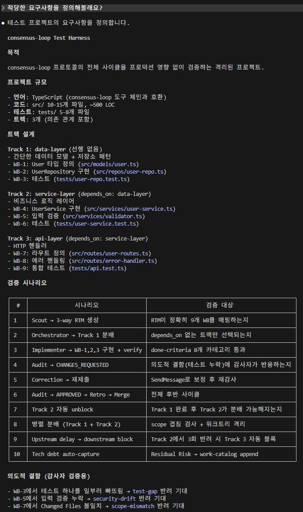
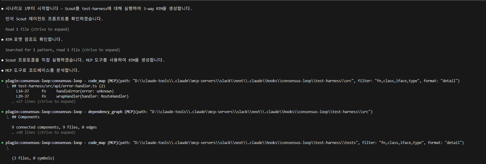

# Consensus Loop — Plugin Reference

> Claude Code hook plugin | Tag-based consensus protocol | HITL retrospective gate

A cross-model audit gate between Claude (implementer) and GPT/Codex (auditor). Every code edit triggers: **edit → audit → agree → retro → commit**.


---

## Why

1. **Independent critic** — separate AI writes and reviews
2. **No progress without consensus** — `[trigger_tag]` stays until `[agree_tag]`
3. **HITL retrospective** — session-gate blocks commits until retrospective completes
4. **Policy as data** — edit `references/` files to change audit criteria, no code changes

---

## How It Works

```
Code Edit → PostToolUse hook
    ├─ watch_file + trigger_tag → audit → verdict
    │    ├─ [agree_tag] → retro → commit
    │    └─ [pending_tag] → correction → resubmit
    ├─ gpt.md newer → auto-sync
    └─ quality rule match → lint/test
```


---

## Skills (9)

| Skill | Shortcut | Purpose |
|-------|----------|---------|
| `consensus-loop:orchestrator` | `/cl-orch` | Distribute tasks, track agents, manage corrections |
| `consensus-loop:planner` | `/cl-plan` | PRD + work breakdowns + 10 design document types |
| `consensus-loop:verify` | `/cl-verify` | Run 8 done-criteria checks (CQ/T/CC/CL/S/I/FV/CV) |
| `consensus-loop:merge` | `/cl-merge` | Squash-merge worktree + emergency rollback |
| `consensus-loop:retrospect` | `/cl-retro` | Extract learnings, manage memories (Quick/Full) |
| `consensus-loop:audit` | `/cl-audit` | Manual audit trigger |
| `consensus-loop:status` | `/cl-status` | Current state check |
| `consensus-loop:guide` | `/cl-guide` | Evidence package writing guide |
| `consensus-loop:tools` | `/cl-tools` | CLI for 9 MCP tools |

## Agents (4)

| Agent | Model | Purpose |
|-------|-------|---------|
| **Implementer** | Sonnet | Headless worker, worktree isolation, code + test + evidence |
| **Scout** | Opus | Read-only RTM generator (Forward/Backward/Bidirectional) |
| **UI Reviewer** | Sonnet | Browser-based UI verification (claude-in-chrome) |


## Hooks (12)

| Hook | Handler | Blocks? |
|------|---------|---------|
| SessionStart | session-start.mjs | No |
| Stop | session-stop.mjs | No |
| PreToolUse (Bash\|Agent) | session-gate.mjs | **Yes** (retro pending) |
| PostToolUse (Edit\|Write) | index.mjs | No |
| PreCompact | pre-compact.mjs | No |
| PostCompact | post-compact.mjs | No |
| SubagentStart (implementer\|scout) | subagent-start.mjs | No |
| SubagentStop (implementer) | subagent-stop.mjs | No |
| WorktreeCreate | worktree-create.mjs | **Yes** (creates worktree) |
| WorktreeRemove | worktree-remove.mjs | No |
| TeammateIdle | teammate-idle.mjs | **Yes** (CQ gate) |
| TaskCompleted | task-completed.mjs | **Yes** (done-criteria) |

---

## Orchestrator Workflow


### Task Complexity Tiers

| Tier | When | Protocol |
|------|------|----------|
| **T1 Micro** | 1-2 files, trivial | Direct fix, no worktree, skip audit |
| **T2 Standard** | 3-8 files | Worktree + audit cycle (default) |
| **T3 Complex** | 8+ files, cross-track | Mandatory scout + full audit + regression |

### Scout → RTM → Distribute


### Audit → Correction → Approval


---

## Design Documents (Planner)

The planner produces 10 document types across 2 levels:

**Project level**: PRD, execution-order, work-catalog, ADR
**Track level**: README, work-breakdown, api-contract, test-strategy, ui-spec, data-model

Each has a reference guide at `skills/planner/references/`.

---

## Test Harness

Standalone TypeScript project validating the full protocol cycle (44 tests, 10 scenarios).




---

## Install

### Plugin (Recommended)

```bash
claude plugin marketplace add berrzebb/claude-plugins
claude plugin install consensus-loop@berrzebb-plugins
```

### Local Dev

```bash
claude --plugin-dir .claude/hooks/consensus-loop
```

### Config

Edit `config.json` — tags, paths, quality rules. See `examples/config.example.json`.

**Policy changes**: edit `templates/references/{locale}/*.md`. No code changes needed.

---

## MCP Tools (9)

| Tool | Purpose |
|------|---------|
| `code_map` | Symbol index (fn/class/type) with line ranges |
| `dependency_graph` | Import/export DAG, cycles, topological sort |
| `audit_scan` | Pattern scan (type-safety, hardcoded, console) |
| `coverage_map` | Per-file coverage from vitest JSON |
| `rtm_parse` | Parse RTM markdown → structured rows |
| `rtm_merge` | Row-level merge of worktree RTMs |
| `audit_history` | Query verdicts, rejection patterns, risk |
| `fvm_generate` | FE route × API × BE endpoint → FVM table |
| `fvm_validate` | HTTP runner for FVM rows |

CLI: `node scripts/tool-runner.mjs <tool> --param value`
